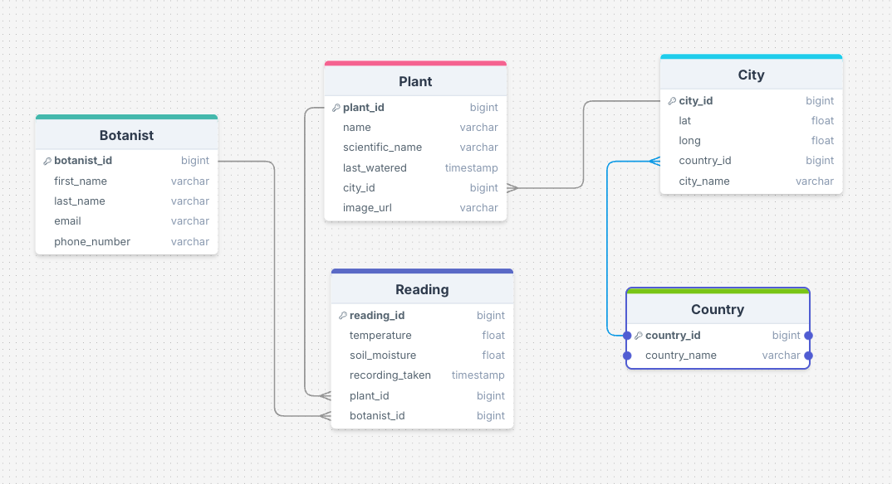

# LMNH Plants Project

This project for the Liverpool Museum of Natural History takes in readings every minute
for each of the plants being monitored, and loads them into a short term & long term archive
for data analysis & visualisations.

# Deliverables
- A full data pipeline, hosted in the cloud (using the specific tech listed below)
- A short-term database solution that can store the full data for the past 24 hours
- A long-term archive solution for data older than 24 hours
- Some form of visualisation for the data

# Team
- **Architecture & DevOps**: Riaz Rahman & Catalina Creanga
- **Quality Assurance**: Aaron Sahota
- **Project Manager**: Nicanor Enguerra
- **Engineer & Analyst**: All of the above

# Architecture Diagram

- An `ECS Fargate` service reads daily readings data from individual `API` endpoints and passes the data through an `ETL` pipeline to process data for storage.
- An `EventBridge` cron-job triggers the `ECS Fargate` task every minute to run the pipeline for new data points.
- The data is uploaded to an `AWS RDS` database for short term storage. 
- A `lambda` function that extracts data from the `RDS` and processes it through an `ETL` pipeline to create daily summary `parquet` files and uploads them to an `AWS S3` bucket for long term storage. 
- An `EventBridge` cron-job triggers the `lambda` task every day at 9am to run the pipeline for the last 24 hour data.
- `Amazon Athena` and `Glue Crawler` are used to query and create tables from the partitioned files in the `S3` bucket.
- An `ECS Fargate` service retrieves daily data from `RDS` and the query data from `Athena` and runs a `Streamlit` visualisation dashboard using the data.
- User can then interact with the data via Dashboard.

# Entity Relationship Diagram

- `Plant table`: plant_id(`PRIMARY KEY`), name, scientific_name, last_watered, city_id(`FOREIGN KEY`), image_url
- `Reading table`: reading_id(`PRIMARY KEY`), temperature, soil_moisture, recoding_taken, plant_id(`FOREIGN KEY`), botanist_id(`FOREIGN KEY`)
- `Botanist table`: botanist_id(`PRIMARY KEY`), first_name, last_name, email, phone_number
- `City table`: city_id(`PRIMARY KEY`), lat, long, country_id(`FOREIGN KEY`), city_name
- `Country table`: country|_id(`PRIMARY KEY`), country_name